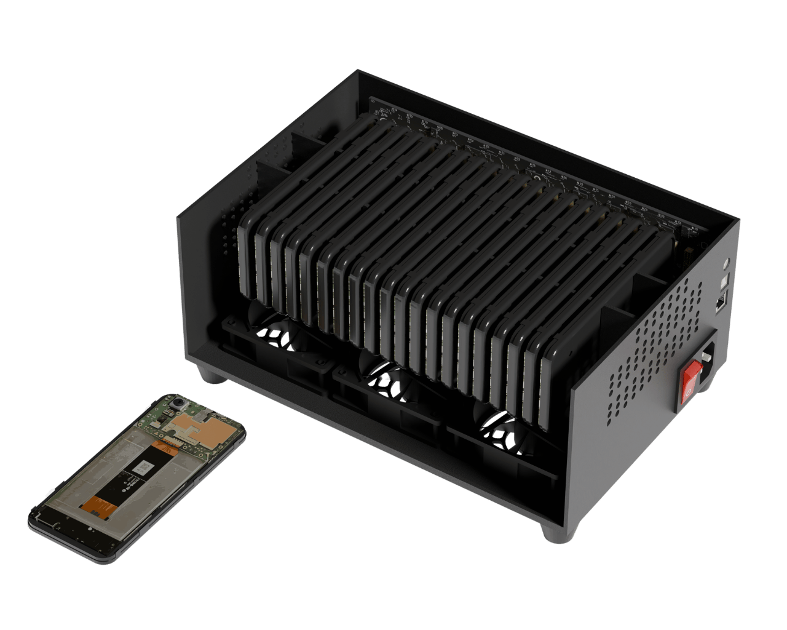

# Welcome to Cellhasher

***

<figure><figcaption></figcaption></figure>

## **What is a Cellhasher?** 

A Cellhasher is a custom chassis, often refered to as a "phone farm box", that allows managing many smartphones efficiently at scale.

It is designed to keep hardware organized, low temperature, and easy to manage. Products are available either as DIY kits for customers to use their own phones or fully completed with phones pre-installed. Cellhasher models sold without phones (as a DIY kit) contain a complete set of accessory hardware needed to run the phones sustainably (i.e. battery-less). The Cellhasher Team also provides services for disassmebling and installing your existing devices into a Cellhasher by sending those devices in.

#### Why Using a Cellhasher is Better Than Managing Phones Normally 

1. **Safety** **-** Running smartphones 24/7 with their batteries can cause extreme heat, thermal throttling, and battery bloating. This is a significant fire hazard! Cellhasher eliminates this risk by allowing you to operate phones without batteries, directly powered by the unit's PSU.
2. **Energy Consumption** **-** Between optimized power delivery and battery-less devices, overall energy usage is even further reduced. Thus, the _compute-per-watt_ ratio of smartphones grows stronger, becoming one of the most cost-effective computing solutions globally.
3. **Performance** **-** Cellhasher's design orients the phones and cooling fans optimally to minimize heat, ensuring your devices run at peak performance. Cellhasher provides great connection speeds via USB and Ethernet to aid in each device's performance as well.
4. **Convenience** **-** Managing multiple smartphones is easier with Cellhasher. It centralizes control, allowing you to monitor, update, and manage all devices simultaneously through dedicated software. Cellhasher offers software tools that streamline tasks. This integration makes managing mobile compute possible at scale.

***

## **Expansive Uses**

Cellhasher's applications are near-endless.  Whether your application benefits from multiple devices, unified computing power, or the customization of Androids, the possibilities of phones are plentiful. Cellhasher is making it possible to run these devices at scale.

## **Software to Scale** &#x20;

At the heart of Cellhasher’s innovation is the Cellhasher Control software, which allows seamless management of multiple devices from your computer. Instead of manually operating each phone, you can run a variety of commands remotely, streamlining multi-device control.

## **Our Commitment**

We are committed to sustainable use of technology and innovate for the longevity of existing hardware. Our solutions strive for energy efficiency by reducing wattage, eliminating batteries, and organizing setups.&#x20;
