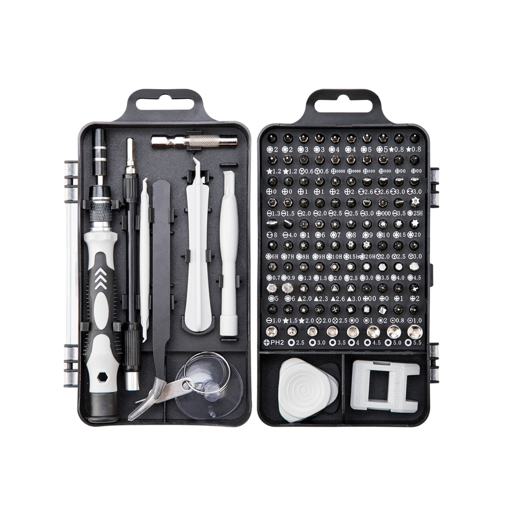
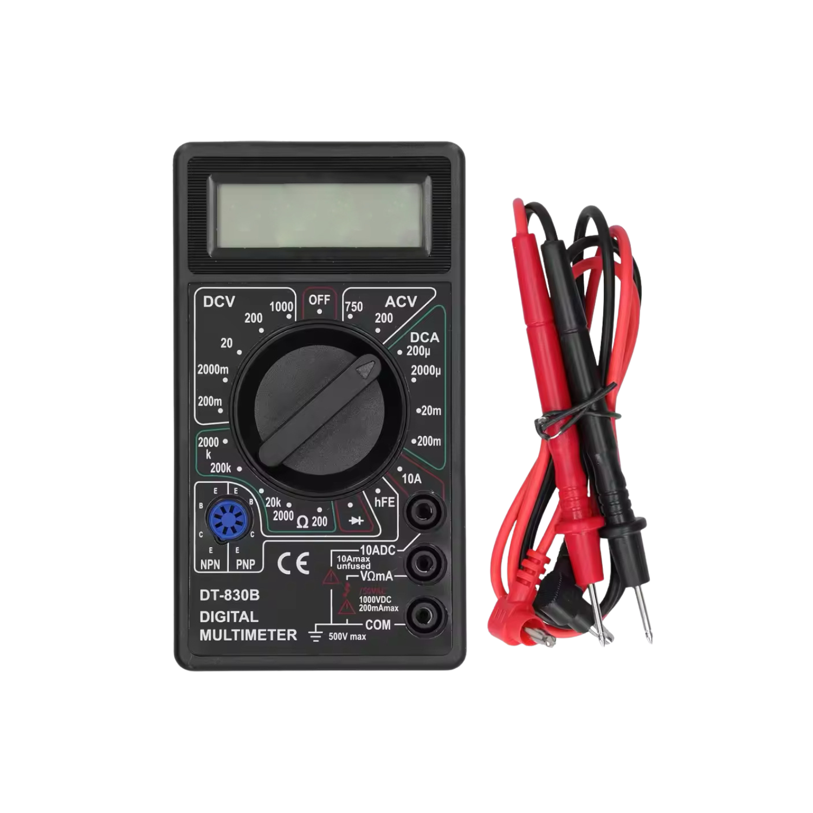
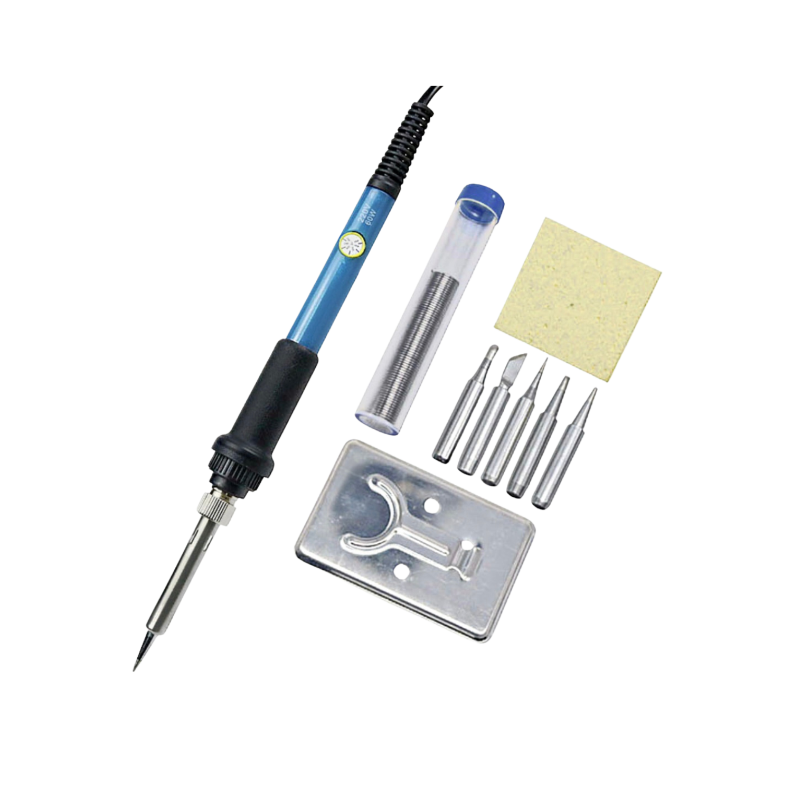
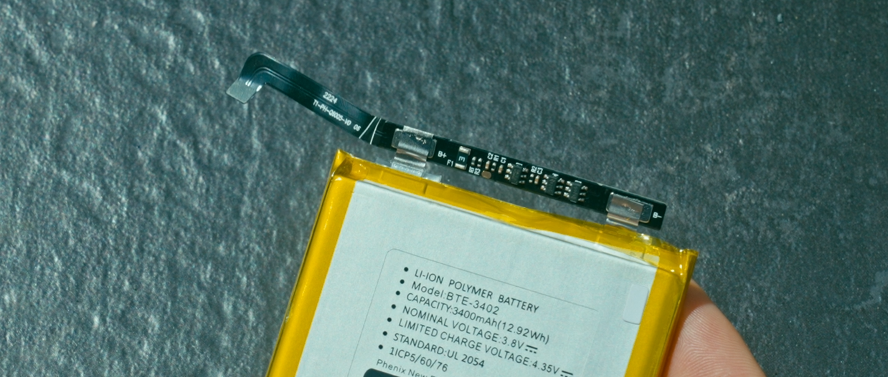
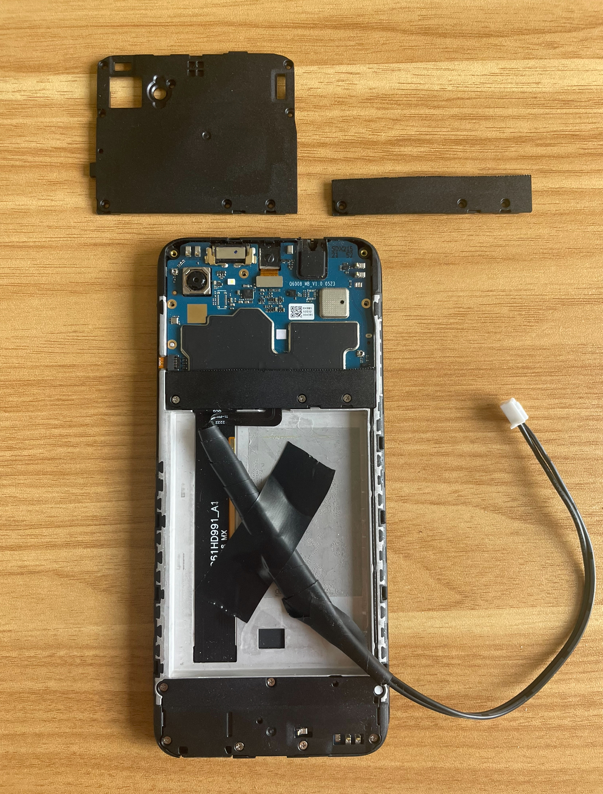

# Set-Up (Classic, Reverse, Rackmount)

***

## Step 1: Gather Equipment

#### 1. Aquire Android smartphone(s)

Most activities related to Cellhasher require Androids. This guide is not designed for iPhones. Furthermore, Cellhasher Control does not support iPhones.&#x20;

#### 2. Gather tools or purchase with Cellhasher

* Disassembly kit for phones (for step 3)
* Multimeter (for step 4)
* Soldering iron & solder wire (for step 5)

<figure><figcaption></figcaption></figure> <figure><figcaption></figcaption></figure> <figure><figcaption></figcaption></figure>

## Step 2: Prepare Phones

Head to [enabling-usb-and-wireless-debugging.md](../additional-docs/enabling-usb-and-wireless-debugging.md) and complete this process for your phones.

## Step 3: Disassemble Phones

> **🚨 Danger:** Lithium-ion batteries can combust if punctured. Be very careful and perform your due diligence before proceeding.

#### 1. Remove the battery and other optional components

Using a disassembly kit, remove the outer casing on the phone to expose the internal components. Remove any additional guards or coverings securing the battery. Carefully proceed by researching how to remove your specific phone model's battery. For instance, applying 90% isopropyl separates any adhesives well. Set the battery aside. In most cases, this is sufficient but you may continue to detach other components such as the camera, screen, or haptic engine as you wish.

<figure><figcaption></figcaption></figure>

#### 2. Record your phone's voltage requirements

Review the label on the battery and record it's Nominal Voltage and Charge Voltage.

#### 3. Dispose or store the battery properly

Locate the nearest or most convenient recycler or store properly.

## Step 4: Adjust Cellhasher Voltage

> **ℹ️ Note:** Cellhasher outputs the same voltage to all 20 phone ports.

#### 1. Set the input voltage

Determine if the circuit associated to the outlet you plan to connect to is rated for 120V or 240V. This is important to confirm.

Every Cellhasher has an adjustable power supply unit (PSU) that supports either 120V or 240V. You will want to confirm its set to your corresponding circuit. To toggle between these, locate the sticker next to the red switch inside the PSU. Use a long, rigid tool (such as a screw driver) and fully move the slider according to your circuit, if it is not already.

#### 2. Set the output voltage

1. **Determine your required potentiometer**
   * Each Cellhasher comes with a **white** potentiometer installed in the power supply. Provided with each Cellhasher purchase comes an optional **blue** potentiometer. Your phone's Charge Voltage, will determine which potentiometer you need:
     * The **white** potentiometer can be adjusted to output 4.48–5.10V.
     * The **blue** potentiometer can be adjusted to output 4.30–5.25V.
   * If your phone model's Charge Voltage falls within the range of the **white** potentiometer, proceed to c. and adjust the potentiometer.
2.  **Optional: replace the white for the blue potentiometer**

    * Remove the power supply from the Cellhasher unit.&#x20;
    * Only onescrew is holding the lid on the PSU. There are two additional screws required for removing the PSU board from it's shell completely.

    
<figure><figcaption>
Screw holding lid
</figcaption></figure>

3. **Read voltage and adjust potentiometer**
   * Double check your input voltage, then power on your Cellhasher. Continue by using one of the two methods to read the output voltage in order to be able to adjust it accordingly. If you have a Wi-Fi + Ethernet Cellhasher, you will use the mulitmerter method.
     * **Multimeter**: Place your positive and negative pins in on the outputting side of the power supply. This location will read **0.25V** than what the phone will receive. For example, if you read 5.07V here, your phone will receive 4.82V.
     * **Digital meter**: Plug in to any USB port and record. The BMS port receives **0.18V** less than the USB port. For example, if you read 5.0V here, your phone will receive 4.82V.
   * Use stiff, slim screwdriver or other tool to gently spin the potentiometer. It's recommended to start with ½ turns, carefully not over spinning the dial. Use this process to set voltage your phone will recieve to the Charge Voltage. Power off the Cellhasher.

## Step 5: Battery Management System (BMS) Cables

Use one of the following methods for your BMS cables.

### Method 1: Use Cellhasher Provided BMS Cables

**Use Cellhasher Provided BMS Cables**

Cellhasher units come with BMS cables that attach to certain phones without additional DIY. The provided cables work with Samsung S10, S9, S8, S7, S6, Note9, Note8, and Note5 series

### Method 2: Custom Soldering Full Circuit

**Custom Soldering Full Circuit**

Use the entire battery circuit piece by cutting the two tabs from the battery.&#x20;

> **🚨 Danger:** Cut only one tab at a time. Approach it from the nearest side for each cut. Making contact with both tabs at the same time with a metal scissors will cause sparks.

Find the + and - next to each tab on the circuit.

If one of the BMS wires is not red, then the black wire with dashed markings is the positive. Solid black is negative.

Strip your wire ends then solder the positive and negative wire tips to their matching tab.

Wrap with electrical tape or heat shrink.

<figure><figcaption>
Method 2
</figcaption></figure> <figure><figcaption>
Method 2
</figcaption></figure>

<figure><figcaption>
Removing ribbon for method 2 &amp; 3
</figcaption></figure> <figure><figcaption>
Removing ribbon for method 2 &amp; 3
</figcaption></figure> <figure><figcaption>
Removing ribbon for method 2 &amp; 3
</figcaption></figure>

### Method 3: Custom Soldering Without Circuit

**Custom Soldering Without Circuit**

First see if you can determine the positive and negative sides along the ribbon. If you can, you may proceed by cutting the battery circuit as in the image below and gently scratching to expose the trace.&#x20;

If one of the BMS wires is not red, then the black wire with dashed markings is the positive. Solid black is negative.

Strip your wire ends then solder the positive and negative wire tips to their matching trace.

Prevents shorts by wrap with electrical tape or heat shrink.

<figure><figcaption>
Method 3
</figcaption></figure>

<figure><figcaption>
Removing ribbon for method 2 &amp; 3
</figcaption></figure> <figure><figcaption>
Removing ribbon for method 2 &amp; 3
</figcaption></figure> <figure><figcaption>
Removing ribbon for method 2 &amp; 3
</figcaption></figure>

#### Test and Troubleshoot

Ensure the device powers on after connecting the BMS cable. If issues arise, recheck solder connections, voltage settings, and wire orientation.

## Step 6: Tape and Replace Back Plate

Use a snipping tool to cut majority of the backplate off. Leave enough to secure the battery connection point using a few screws. Gently fold, flatten, and tape the BMS cable to secure it.

<figure><figcaption></figcaption></figure>

## Step 7: Insert Phones

Using the USB stubs provided, connect the phones and their BMS cable into each slot on the motherboard. Once complete, power on.

<figure><figcaption></figcaption></figure>

> ✅ **Done!**
>
> Share your set up with the links below and head to [set-up-download.md](../cellhasher-control/set-up-download.md) to start controlling your phones!&#x20;
>
> <a href="https://x.com/CellHasher">Follow Cellhasher on X</a> | <a href="https://discord.com/invite/9bGE6e4X2c">Join us on Discord</a>
